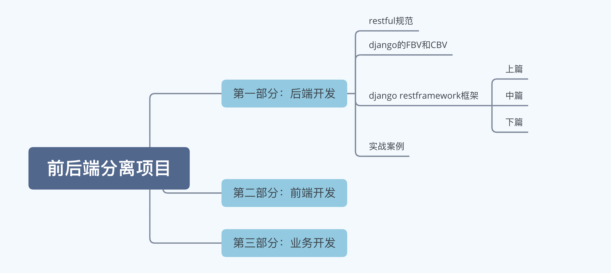
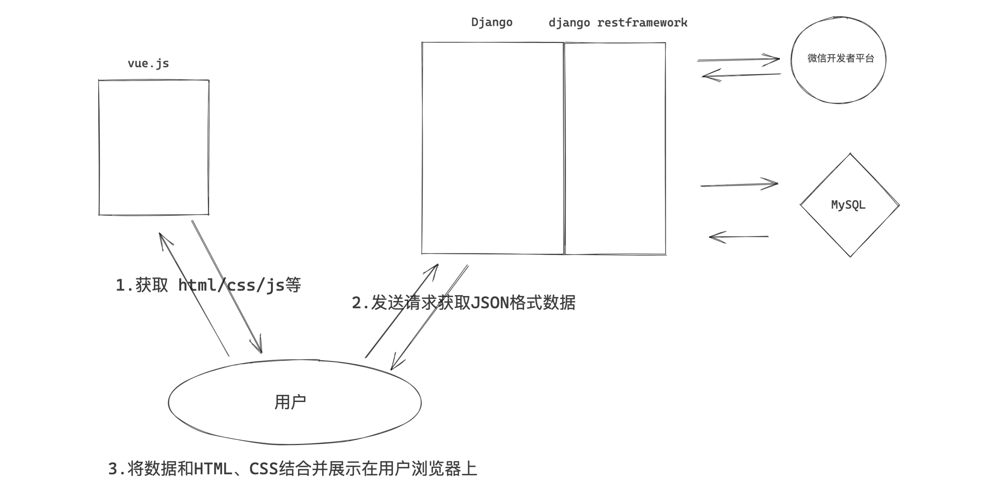
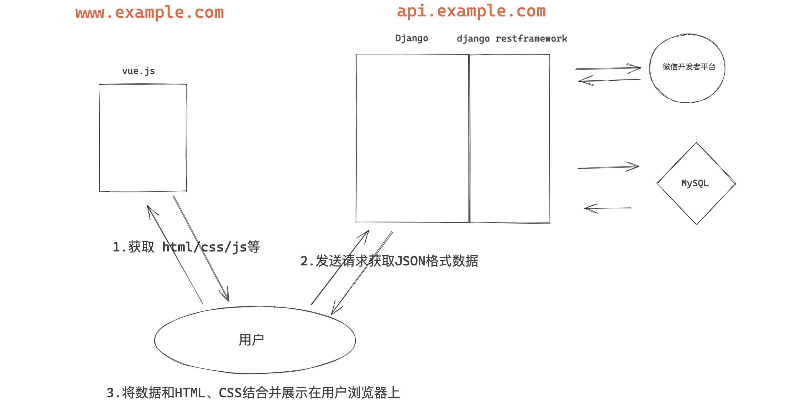
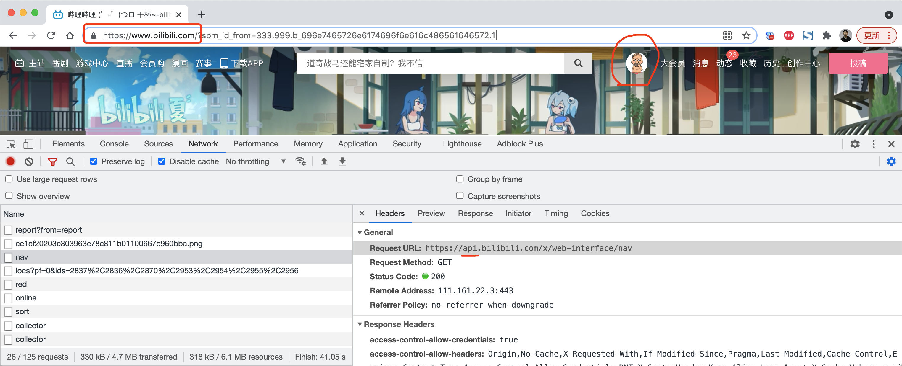
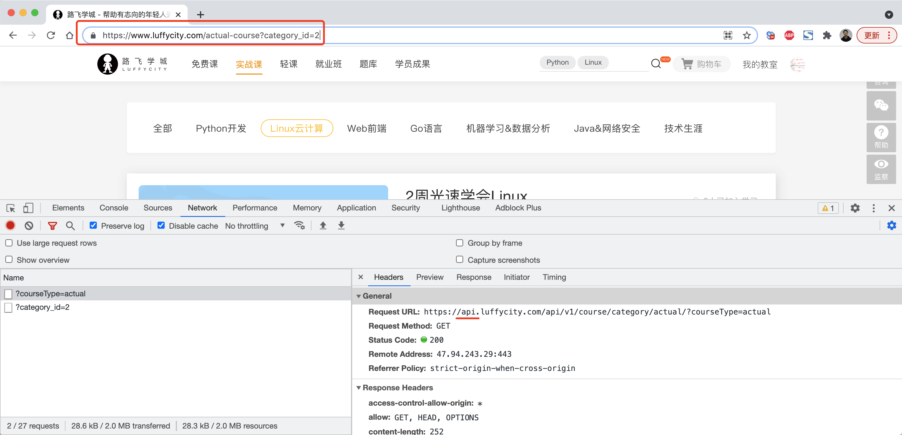
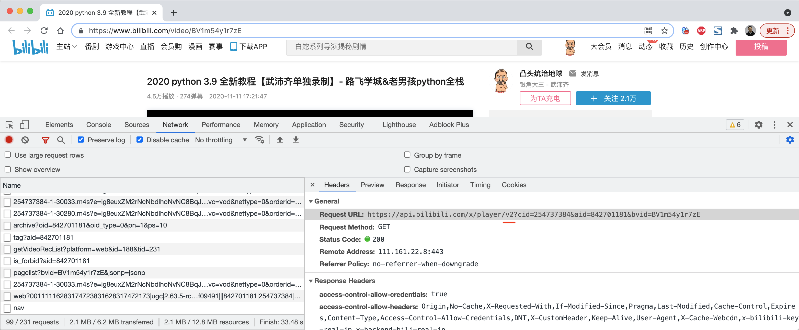
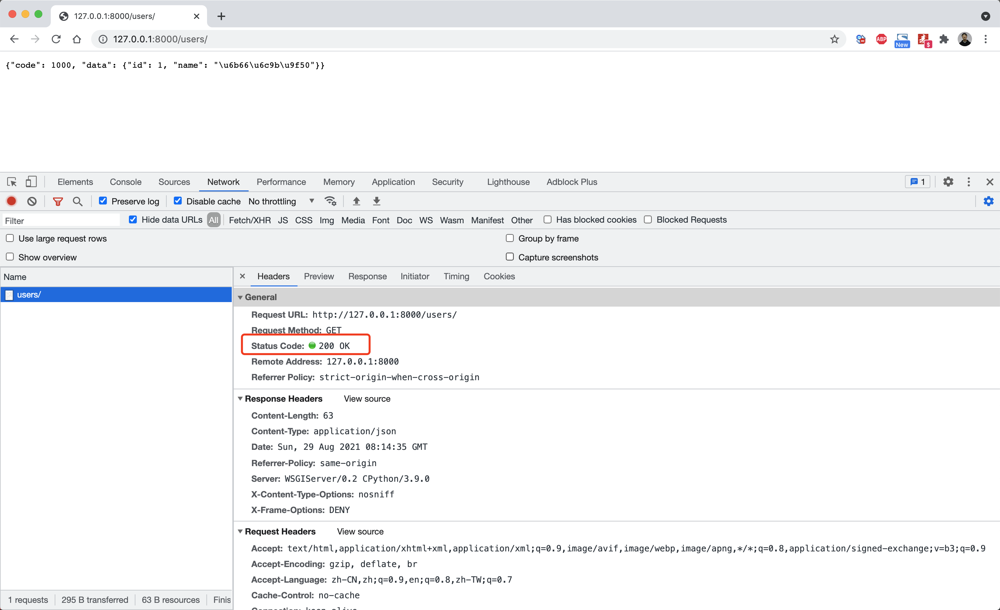

## 第一部分：后端开发




## 1.1 RESTful规范


对于后端开发者，本质上就是提供URL给前端开发者调用并返回相应的数据。例如：


现在咱们大家知道前端后端分离的项目是需要：前端、后端 双方来进行合作开发，既然合作进行开发就必须要提前约定一些规范，以防止双方”打架“，例如：

- 数据传输用XML格式？JSON格式？

- 出现错误时，错误信息有谁来提供？

  ```
  方案1：错误时后端返回错误信息，前端只做呈现即可。
  	{
  		code:40001,
  		error:"xxx错误"
  	}
  方案2：错误时后端返回错误码，前端根据错误码的对应关系呈现。
  	{
  		code:40001
  	}
  ```

- 等等等...

所以，我们需要先来学习下规范，然后再来进行后续开发。


restful是主流的一套API规范，企业进行前后端分离开发一般都会遵循它，他定义了很多规范的条款。

例如：如果现在让大家来开发一个对 **用户表** 进行增删改查的接口，在不了解restful规范前， 大家一定会这样来搞：

```
接口：/users/list/			用户列表
接口：/users/add/			添加用户
接口：/users/detail/(\d+)	用户详细信息
接口：/users/edit/(\d+)	更新用户
接口：/users/del/(\d+)		删除用户
```

很早之前开发者们也确实都是这么干的，直到后来有人提出了 restful API规范（包含了很多规定），如果按照这个规范来开发上述的功能的话：

```
接口：/users/			方法：GET     =>   用户列表
接口：/users/			方法：POST    =>   添加列表
接口：/users/(\d+)/	方法：GET     =>   获取单条数据
接口：/users/(\d+)/	方法：DELETE  =>   删除数据
接口：/users/(\d+)/	方法：PUT     =>   更新数据
```

暂且不说restful规范有多好，对于前端和后端只要能统一了规范，对大家的开发效率都会有很大的帮助，不用再做很多无效的沟通了。


所以，接下来咱们就是学习最常见的restful规范。


### 1.HTTPS协议

建议使用https协议替代http协议，让接口数据更加安全。

这一条其实与开发无关，在最后的项目部署时只要使用https部署即可。




如果是基于HTTP协议，则意味着用户浏览器再向服务器发送数据时，都是以明文的形式传输，如果你在某咖啡厅上网，他就可以把你网络传输的数据明文都获取到。

如果是基于HTTPS协议，则意味着用户浏览器再向服务器发送数据时，都是以密文的形式传输，中途即使有非法用户获取到网络数据，也可以密文的，无法破译。

HTTPS保证了数据安全，但由数据传输存在着加密和解密的过程，所以会比HTTP协议慢一些。


注意：此处大家先了解https和http的不同，至于底层原理和部署，在项目部署时再细讲。

参考文档：https://www.cnblogs.com/wupeiqi/p/11647089.html


### 2. 域名

对于后端API接口中要体现API标识，例如：

- https://**api**.example.com
- https://www.example.com/**api**/










### 3. 版本

对于后端API接口中要体现版本，例如：

```
- http://api.example.com/v1/

- http://api.example.com/?version=v1

- http://v1.example.com/

- http://api.example.com/
  请求头：Accept: application/json; version=v1
```




### 4. 路径

restful API这种风格中认为网络上的一切都称是资源，围绕着资源可以进行 增删改查等操作。

这些资源，在URL中要使用名词表示（可复数），围绕着资源进行的操作就用Method不同进行区分。

```
https://api.example.com/v1/person
https://api.example.com/v1/zoos
https://api.example.com/v1/animals
https://api.example.com/v1/employees
```


### 5. 请求方法

根据请求方法不同进行不同的操作。

```
GET		在服务器取出资源（一项或多项）
POST	在服务器新建一个资源
PUT		在服务器更新资源（客户端提供改变后的完整资源）
PATCH	在服务器更新资源（客户端提供改变的属性）
DELETE	在服务器删除资源
```

例如：

```
https://api.example.com/v1/users
https://api.example.com/v1/users/1/

接口：/users/			方法：GET     =>   用户列表
接口：/users/			方法：POST    =>   添加用户
接口：/users/(\d+)/	方法：GET     =>   获取单条数据
接口：/users/(\d+)/	方法：DELETE  =>   删除数据
接口：/users/(\d+)/	方法：PUT     =>   更新数据
接口：/users/(\d+)/	方法：PATCH   =>   局部更新
```


### 6. 搜索条件

在URL中通过参数的形式来传递搜索条件。

```python
https://api.example.com/v1/users
```

```
https://api.example.com/v1/zoos?limit=10				指定返回记录的数量
https://api.example.com/v1/zoos?offset=10				指定返回记录的开始位置
https://api.example.com/v1/zoos?page=2&per_page=100		指定第几页，以及每页的记录数
https://api.example.com/v1/zoos?sortby=name&order=asc	指定返回结果按照哪个属性排序，以及排序顺序
https://api.example.com/v1/zoos?animal_type_id=1		指定筛选条件
```


### 7. 返回数据

针对不同操作，服务器向用户返回的结果结构应该不同。

```python
https://api.example.com/v1/users
https://api.example.com/v1/users/2/
```

| URL           | 方法   | 描述         | 返回数据                                                     |
| ------------- | ------ | ------------ | ------------------------------------------------------------ |
| /users/       | GET    | 列表         | 返回资源对象的列表<br />[ {id:1,name:"武沛齐"},   {id:1,name:"日天"}  ] |
| /users/       | POST   | 添加         | 返回新生成的资源对象<br />{id:1,name:"武沛齐"}               |
| /users/(\d+)/ | GET    | 获取单条数据 | 返回单个资源对象<br />{id:1,name:"武沛齐"}                   |
| /users/(\d+)/ | DELETE | 删除数据     | 返回一个空文档<br />null                                     |
| /users/(\d+)/ | PUT    | 更新数据     | 返回完整的资源对象<br />{id:1,name:"武沛齐"}                 |
| /users/(\d+)/ | PATCH  | 局部更新     | 返回完整的资源对象<br />{id:1,name:"武沛齐"}                 |

一般在实际的开发过程中会对上述返回数据进行补充和完善，例如：每次请求都返回一个字典，其中包含：

- code，表示返回码，用于表示请求执行请求，例如：0表示请求成功，1003表示参数非法，40009数据量太大等。
- data，表示数据
- error，错误信息

```python
{
    code:0,
    data:[ {id:1,name:"武沛齐"},   {id:1,name:"日天"}  ]
}
```

```python
{
    code:41007,
    error:"xxxxx"
}
```


### 8. 状态码

后端API在对请求进行响应时，除了返回数据意外还可以返回状态码，来表示请求状况。

```python
from django.urls import path, include
from app01 import views

urlpatterns = [
    path('users/', views.users),
]
```

```python
from django.http import JsonResponse

def users(request):
    info = {
        "code": 1000,
        "data": {"id":1,"name":"武沛齐"}
    }
    return JsonResponse(info, status=200)
```




```
200 OK - [GET]：服务器成功返回用户请求的数据
201 CREATED - [POST/PUT/PATCH]：用户新建或修改数据成功。
202 Accepted - [*]：表示一个请求已经进入后台排队（异步任务）
204 NO CONTENT - [DELETE]：用户删除数据成功。
400 INVALID REQUEST - [POST/PUT/PATCH]：用户发出的请求有错误，服务器没有进行新建或修改数据的操作。
401 Unauthorized - [*]：表示用户未认证（令牌、用户名、密码错误）。
403 Forbidden - [*] 表示用户得到授权（与401错误相对），但是访问是被禁止的。
404 NOT FOUND - [*]：用户发出的请求针对的是不存在的记录，服务器没有进行操作。
406 Not Acceptable - [GET]：用户请求的格式不可得（比如用户请求JSON格式，但是只有XML格式）。
410 Gone -[GET]：用户请求的资源被永久删除，且不会再得到的。
422 Unprocesable entity - [POST/PUT/PATCH] 当创建一个对象时，发生一个验证错误。
500 INTERNAL SERVER ERROR - [*]：服务器发生错误，用户将无法判断发出的请求是否成功。

更多看这里：http://www.w3.org/Protocols/rfc2616/rfc2616-sec10.html
```


状态码可以表示一部分的服务端的处理请求，但特别细致的信息无法全都都包括，所以一般在开发中会配合code返回码来进行。

例如：https://developers.weixin.qq.com/doc/offiaccount/Getting_Started/Global_Return_Code.html

### 9. 错误处理

错误处理，状态码是4xx时，应返回错误信息，error当做key。

```
{
    error: "Invalid API key"
}
```

在 1.1.7 中中已包含。


了解常用resful规范，那么以后在开发后端API接口时，就要根据上述要求遵循restful规范（非必须，视公司情况灵活变通）。


### 案例展示

基于django + restful规范来开发一个后台接口示例。

```bash
pip install django==3.2
#创建项目
django-admin startproject demo
cd demo/
#创建应用
django-admin startapp app01

```


```python
# urls.py

from django.urls import path
from app01 import views

# http://www.xxx.com/api/v1/users/

urlpatterns = [
    path('api/<str:version>/users/', views.users),
    path('api/<str:version>/users/<int:pk>/', views.users),
]
```

```python
# views.py

from django.http import JsonResponse


def users(request, version, pk=None):
    print("版本：", version)
    if not pk:
        if request.method == "GET":
            # 请求用户列表
            info = {
                "code": 0,
                "data": [{"id": 1, "name": "武沛齐"}]
            }
            return JsonResponse(info)
        elif request.method == "POST":
            # 新增用户，读取 request.POST 中提交的数据并添加到数据库中
            info = {
                "code": 0,
                "data": {"id": 1, "name": "武沛齐"}
            }
            return JsonResponse(info)
        else:
            info = {
                "code": 1000,
                "error": "请求错误"
            }
            return JsonResponse(info)

    if request.method == "GET":
        # 获取ID=pk的用户信息，并返回
        info = {
            "code": 0,
            "data": {"id": 1, "name": "武沛齐"}
        }
        return JsonResponse(info)
    elif request.method == "DELETE":
        # 删除id=pk的用户
        info = {
            "code": 0,
            "data": {}
        }
        return JsonResponse(info)
    elif request.method == "PUT":
        # 读取request.POST中的数据 + pk，更新数据库中的用户信息
        info = {
            "code": 0,
            "data": {"id": 1, "name": "武沛齐"}
        }
        return JsonResponse(info)
    elif request.method == "PATCH":
        # 读取request.POST中的数据 + pk，更新数据库中的用户信息
        info = {
            "code": 0,
            "data": {"id": 1, "name": "武沛齐"}
        }
        return JsonResponse(info)
    else:
        info = {
            "code": 1000,
            "error": "请求错误"
        }
        return JsonResponse(info)

```


运行 测试

```bash

cd demo
python manage.py runserver 
curl http://127.0.0.1:8000/api/v1/users/2/
{"code": 0, "data": {"id": 1, "name": "\u6b66\u6c9b\u9f50"}}


```

